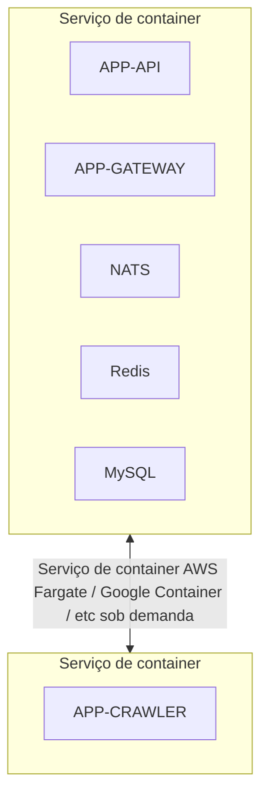
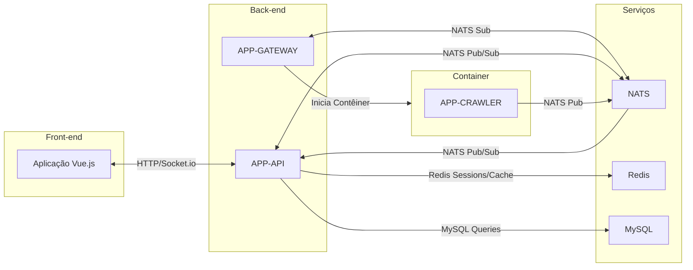
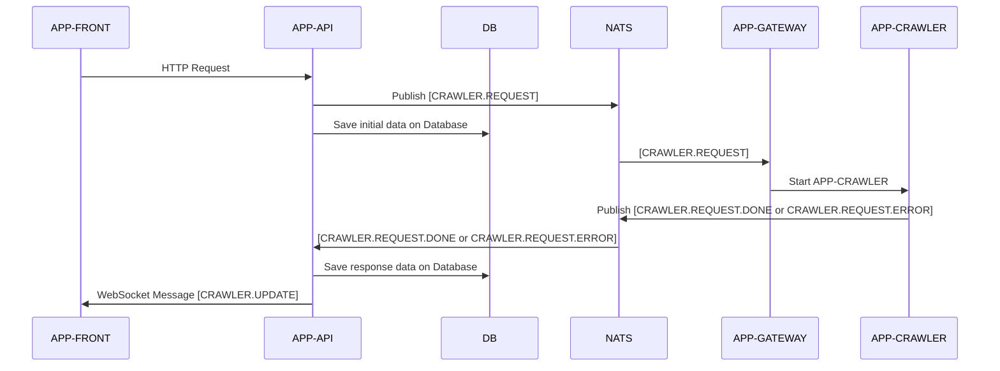

# Arquitetura da Aplicação *(módulo 1)*

Para garantir o funcionamento e a comunicação das aplicações, usaremos as ferramentas abaixo: 

### 1. Docker *([Módulo 2](../dia2/README.md))*

- **Descrição:** Plataforma de código aberto para automatizar a implantação, o dimensionamento e a gestão de aplicações em contêineres.
- **Responsabilidades:**
  - Facilitar o desenvolvimento, teste e implantação de aplicações.
  - Isolar ambientes de desenvolvimento e produção.
  - Garantir a portabilidade e escalabilidade das aplicações.

### 2. MySQL *([Módulo 3](../dia3/README.md))*

- **Descrição:** Sistema de gerenciamento de banco de dados relacional de código aberto.
- **Responsabilidades:**
  - Armazenar informações de rastreios e usuários.
  - Garantir a integridade e consistência dos dados.
  - Oferecer suporte a consultas complexas e transações seguras.

### 3. NATS *([Módulo 4](../dia4/README.md))*

- **Descrição:** Serviço de mensageria leve e de alto desempenho.
- **Responsabilidades:**
  - Facilitar a comunicação entre os serviços da aplicação.
  - Implementar o padrão de arquitetura dirigida por eventos (EDA).
  - Garantir a escalabilidade e a confiabilidade da comunicação.

Para integrar as aplicações e garantir a comunicação entre elas, **vamos desenvolver quatro componentes principais**:

### 4. APP-CRAWLER *([Módulo 5](../dia5/README.md))*

- **Descrição:** Microserviço desenvolvido em **TypeScript**, utilizando **Puppeteer** e **NATS**.
- **Responsabilidades:**
  - Receber configurações via variáveis de ambiente.
  - Realizar a extração de título e descrição das páginas web.
  - Enviar os resultados de volta ao **APP-API** via **NATS**.

### 5. APP-GATEWAY *([Módulo 6](../dia6/README.md))*

- **Descrição:** Serviço intermediário desenvolvido em **Nest.js** que atua como orquestrador.
- **Responsabilidades:**
  - Receber pedidos de rastreio do **APP-API** via **NATS**.
  - Iniciar contêineres Docker do **APP-CRAWLER** para processar cada solicitação.
  - Garantir que os recursos sejam gerenciados de forma eficiente.

### 6. APP-API *([Módulo 7](../dia7/README.md))*

- **Descrição:** Back-end principal desenvolvido em **Nest.js**.
- **Responsabilidades:**
  - Disponibilizar uma **API RESTful** para o front-end consumir.
  - Gerenciar **autenticação e autorização** dos usuários.
  - Enviar notificações ao **APP-FRONT** via **WebSocket**.
  - Solicitar rastreios ao **APP-GATEWAY** via **NATS**.
  - Processar eventos de retorno emitidos pelo **APP-GATEWAY**.
  - Ler e armazenar informações de rastreios via **MySQL**. *([Módulo 3](../dia3/README.md))*

### 7. APP-FRONT *([Módulo 8](../dia8/README.md))*

- **Descrição:** Aplicação front-end desenvolvida em **Vue.js 3** com **TypeScript**.
- **Responsabilidades:**
  - Fornecer uma interface amigável para o usuário interagir com o sistema.
  - Comunicar-se com o **APP-API** via **HTTP** para operações tradicionais e via **WebSocket** para atualizações em tempo real.

---

### Infraestrutura

Toda a infraestrutura back-end será containerizada usando **Docker**, o que facilitará o desenvolvimento, teste e implantação. *([Módulo 2](../dia2/README.md))*
A comunicação entre aplicações internas acontecerá através do NATS - serviço de mensageria leve, robusto e de fácil uso, que permitirá uma aplicação pronta para escala através de Event-Driven. *([Módulo 6](../dia6/README.md))*

#### Fluxo de infraestrutura 

*Figura 1: Demonstração de separação de serviços de container para Crawler e outras aplicações.*

---

### Diagrama de Comunicação

Para visualizar melhor como os componentes interagem entre si, confira o diagrama abaixo:

*Figura 2: Interação entre os componentes da aplicação.*

---

### Fluxo de comunicação para início de rastreio

Quando um usuário solicita um rastreio através do front-end, o fluxo de comunicação entre os componentes é o seguinte:

*Figura 3: Interação de solicitação de rastreio*

---

## Links e Referências

Para auxiliar no desenvolvimento e aprofundamento dos conhecimentos, seguem algumas referências úteis:

- [Mermaid - Diagramas e Visualização](https://mermaid.js.org/intro/)
- [Docker - Guia de Início Rápido](https://docs.docker.com/get-started/)
- [MySQL - Documentação Oficial](https://dev.mysql.com/doc/)
- [NATS - Site Oficial](https://nats.io/)
- [Puppeteer - Documentação Oficial](https://pptr.dev/)
- [Nest.js - Primeiros Passos](https://docs.nestjs.com/first-steps)
- [Vue.js 3 - Guia de Início Rápido](https://vuejs.org/guide/quick-start)
- [TypeScript - Documentação Oficial](https://www.typescriptlang.org/docs/)

---

Estamos animados para iniciar este projeto com vocês. Este treinamento será uma oportunidade para aplicar na prática conceitos avançados de desenvolvimento de software, arquitetura de sistemas distribuídos e melhores práticas de engenharia.

Vamos juntos construir uma aplicação robusta e escalável, aprendendo e compartilhando conhecimentos ao longo do caminho.

---

## Navegar pelo projeto
- [Apresentação do projeto](../README.md)
- **Módulo 1**: Arquitetura da Aplicação *(Você está aqui)*
- **Módulo 2** [Introdução ao Docker](../dia2/README.md)
- **Módulo 3** [MySQL básico](../dia3/README.md)
- **Módulo 4** [Introdução ao NATS](../dia4/README.md)
- **Módulo 5**: [Introdução ao TypeScript com Projeto Prático](../dia5/README.md)
- **Módulo 6**: [Introdução ao NestJS e Criação do Gateway](../dia6/README.md)
- **Módulo 7**: [Aplicação de API com NestJS e NATS](../dia7/README.md)
- **Módulo 8**: [Front-end com Vue.js 3](../dia8/README.md)