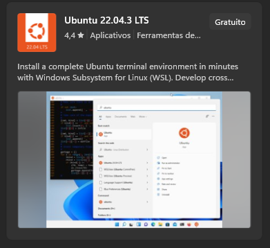

# **Guia para instalação do WSL e docker no Ubuntu 22.04**

## **Requisitos:**

- Windows 10 (versão 1903 ou superior) ou Windows 11.
- Ativar WSL 2 (Windows Subsystem for Linux 2).
- 4 GB de RAM ou mais.
- Ubuntu 22.04 instalado no WSL.

## **Instalando WSL2 com Ubuntu 22.04**

[Documentação Microsoft](https://learn.microsoft.com/pt-br/windows/wsl/install)

### Passo 1: Instalando WSL

Primeiro, abra um terminal Powershell como administrador. No terminal, execute o comando

```bash
wsl --install
```

### Passo 2: Instalando Ubuntu no WSL

Agora, abra a Microsoft Store e busque por Ubuntu 22 e instale.  


## **Instalando o Docker no Ubuntu 22.04**

Para instalar o Docker no Ubuntu 22.04 sem usar o Docker Desktop do Windows, siga os passos abaixo:

### **Passo 1: Atualizar o sistema**

Primeiro, atualize o seu sistema para garantir que todos os pacotes estão nas versões mais recentes:

```bash
sudo apt update
sudo apt upgrade
```

### **Passo 2: Instalar dependências**

Instale as dependências necessárias para adicionar o repositório do Docker:

```bash
sudo apt install apt-transport-https ca-certificates curl software-properties-common
```

### **Passo 3: Adicionar o repositório Docker**

Adicione a chave GPG oficial do Docker e o repositório Docker às fontes APT do seu sistema:

```bash
curl -fsSL https://download.docker.com/linux/ubuntu/gpg | sudo gpg --dearmor -o /usr/share/keyrings/docker-archive-keyring.gpg
echo "deb [arch=amd64 signed-by=/usr/share/keyrings/docker-archive-keyring.gpg] https://download.docker.com/linux/ubuntu $(lsb_release -cs) stable" | sudo tee /etc/apt/sources.list.d/docker.list > /dev/null
```

### **Passo 4: Instalar o Docker**

Atualize o índice do pacote APT e instale a versão mais recente do Docker:

```bash
sudo apt update
sudo apt install docker-ce docker-ce-cli containerd.io
```

### **Passo 5: Iniciar e habilitar o Docker**

Habilite a API de acesso à docker, editando o arquivo `/lib/systemd/system/docker.service` com um editor de texto como o `nano`:

```bash
nano /lib/systemd/system/docker.service
```

Com `nano`, navegue usando as setas do teclado até o final da linha `ExecStart=...` e habilite a API inserindo `-H=tcp://0.0.0.0:2375` no final. A linha deve ficar assim:

```conf
ExecStart=/usr/bin/dockerd -H fd:// --containerd=/run/containerd/containerd.sock -H=tcp://0.0.0.0:2375
```

Para salvar, pressione `Ctrl` + `O` e confirme com enter. 
Para sair, pressione `Ctrl` + `X` para sair do editor nano.

Depois, inicie o serviço Docker a cada vez que iniciar o computador.

No WSL, execute:
```bash
sudo service docker start
```

No Linux (SO), execute:
```bash
sudo systemctl enable docker
sudo systemctl daemon-reload
sudo systemctl start docker
```

### **Passo 6: Adicionar seu usuário ao grupo Docker** (*Opcional*)

Adicione seu usuário ao grupo Docker para que você possa executar comandos Docker sem sudo:

```bash
sudo usermod -aG docker $USER
```

### **Passo 7: Verificar instalação**

Reinicie sua sessão (ou o sistema) e verifique se o Docker está funcionando corretamente:

```bash
docker --version
docker run --rm hello-world
```

Se tudo estiver configurado corretamente, você verá uma mensagem indicando que o Docker está funcionando.

---

## Navegar pelo projeto
- [Apresentação do projeto](../README.md)
- **Módulo 1**: [Arquitetura da Aplicação](../dia1/README.md)
- **Módulo 2** [Introdução ao Docker](./README.md)
- - Instalando docker em Linux / WSL *(Você está aqui)*
- - [Instalando Docker Desktop em Windows / Mac](./1-instalando-docker-desktop.md)
- - [Como o Docker Funciona](./2-como-docker-funciona.md)
- - [Docker Volume](./2-docker-volume.md)
- - [Docker Compose e MySQL 8](./3-docker-compose-e-mysql.md)
- **Módulo 3** [MySQL básico](../dia3/README.md)
- **Módulo 4** [Introdução ao NATS](../dia4/README.md)
- **Módulo 5**: [Introdução ao TypeScript com Projeto Prático](../dia5/README.md)
- **Módulo 6**: [Introdução ao NestJS e Criação do Gateway](../dia6/README.md)
- **Módulo 7**: [Aplicação de API com NestJS e NATS](../dia7/README.md)
- **Módulo 8**: [Front-end com Vue.js 3](../dia8/README.md)