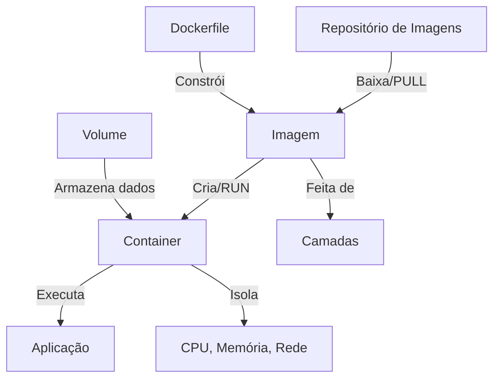
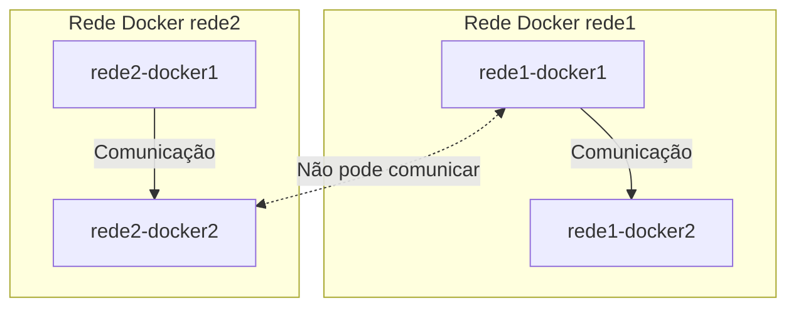

## **O que é Docker e Containers?**

Docker é uma plataforma que permite empacotar, distribuir e rodar aplicativos de forma isolada dentro de containers. Um container é uma unidade de software leve que contém tudo o que um aplicativo precisa para rodar, incluindo o código, bibliotecas e dependências. Isso garante que o aplicativo funcione de maneira consistente em diferentes ambientes, seja no seu computador local ou em servidores na nuvem.

### **Diferença entre Containers e Máquinas Virtuais (VMs)**

Tradicionalmente, usamos máquinas virtuais (VMs) para isolar aplicações. VMs necessitam de um sistema operacional completo, o que consome muitos recursos. Em contraste, os containers compartilham o mesmo kernel do sistema operacional, tornando-os mais leves e rápidos de iniciar.

### **Vantagens dos Conteineres Docker**

- **Isolamento**: Cada container é isolado dos demais, o que garante que as aplicações não se interfiram.
- **Consistência**: Você pode rodar a mesma aplicação com as mesmas dependências em qualquer ambiente.
- **Leveza**: Containers utilizam menos recursos em comparação com máquinas virtuais, pois compartilham o mesmo kernel do sistema.
- **Portabilidade**: Você pode mover containers facilmente entre diferentes ambientes, como de um computador local para a nuvem.

---

## **Como Funciona o Docker**

### 1. **Conceitos Básicos do Docker**

#### Repositório de Imagens
- Um **repositório de imagens** é um local onde as imagens Docker são armazenadas e compartilhadas. O Docker Hub é um exemplo de repositório público onde você pode encontrar imagens prontas para uso.
- Pode-se utilizar **repositórios privados** para armazenar imagens personalizadas e compartilhá-las com a equipe.

#### Imagens
- Uma **imagem** no Docker é como um modelo ou "template" para criar containers. Ela contém tudo o que o container precisa para funcionar, como o sistema operacional, arquivos de código, dependências e configurações.
- As imagens são compostas por **camadas**. Cada camada representa uma mudança ou atualização na imagem, e elas são empilhadas para formar a imagem final.

#### Containers
- Um **container** é a execução de uma imagem. Ele é criado a partir da imagem e fornece um ambiente isolado para rodar uma aplicação.
- Os containers são isolados em termos de CPU, memória, rede e sistema de arquivos, garantindo que o código dentro de um container seja executado da mesma maneira, independentemente do ambiente em que está rodando.

#### Volumes
- **Volumes** são usados para armazenar dados de forma persistente, garantindo que eles não sejam perdidos quando o container for removido. Eles permitem que você compartilhe dados entre o host e o container ou entre múltiplos containers.

#### Dockerfile
- O **Dockerfile** é um arquivo de texto que contém instruções passo a passo para construir uma imagem. Ele permite a criação de imagens customizadas de acordo com suas necessidades.



---

### 2. **Comandos Comuns no Docker**

#### Imagens docker

##### `docker pull`
- O comando `docker pull` é usado para baixar uma imagem do Docker Hub ou de outro repositório.

    Exemplos: 
    ```bash
    docker pull nome_da_imagem
    ```

    ```bash
    docker pull hello-world
    ```

##### `docker images`
- O comando `docker images` lista todas as imagens baixadas e armazenadas no seu host.

    Exemplo: 
    ```bash
    docker images
    ```

##### `docker rmi`
- O comando `docker rmi` remove uma imagem do host.

    Exemplos: 
    ```bash
    docker rmi nome_da_imagem
    ```

    ```bash
    docker rmi hello-world
    ```

#### `docker run`
- O comando `docker run` cria e executa um container a partir de uma imagem. Os atributos mais comuns são:
  - `-p <host_port>:<container_port>`: Mapeia portas do host para o container (por exemplo, `-p 8080:80`).
  - `-v <host_path>:<container_path>`: Monta um volume do host no container para persistência de dados (por exemplo, `-v /meus_dados:/dados`).
  - `-e <variavel>=<valor>`: Define variáveis de ambiente dentro do container.
  - `--rm`: Remove o container automaticamente após ele ser parado.
  - `-d`: Roda o container em segundo plano (modo "detached").
  - `-t`: Aloca um pseudo-terminal.
  - `-i`: Mantém o container em execução de forma interativa.

    Exemplo:
    ```bash
    docker run -p 8080:80 -v /meus_dados:/dados -e MEU_ENV=producao --rm -d nome_da_imagem
    ```
    Ou com terminal interativo:
    ```bash
    docker run -p 8080:80 -v /meus_dados:/dados -e MEU_ENV=producao --rm -ti nome_da_imagem
    ```

#### `docker exec -ti <container_id> bash`
- Esse comando permite acessar o terminal de um container em execução, usando o modo interativo. Isso é útil para inspecionar o que está acontecendo dentro do container.

    Exemplo:
    ```bash
    docker exec -ti 123abc456 bash
    ```

    Ou pelo nome do container:
    ```bash
    docker exec -ti nome_do_container bash
    ```

#### `docker ps`
- Lista todos os containers em execução no momento.

    Exemplo:
    ```bash
    docker ps
    ```

#### `docker ps -a`
- Lista todos os containers, incluindo aqueles que já foram parados.

    Exemplo:
    ```bash
    docker ps -a
    ```

#### `docker rm` 
- **`docker rm <container_id>`**: Remove containers parados.
    Exemplo:
    ```bash
    docker rm 123abc456
    ```

    Ou, pelo nome do container:
    ```bash
    docker rm nome_do_container
    ```

---

### 3. **Volumes e Persistência de Dados**

#### O Que São Volumes
Volumes são utilizados para salvar dados fora do container, permitindo que eles sejam preservados mesmo que o container seja removido ou recriado.

#### Criando e Usando Volumes
Para criar um volume e montá-lo em um container, use o seguinte comando:

```bash
docker run -v /meus_dados:/dados nome_da_imagem
```

Nesse exemplo, os dados dentro do container no diretório `/dados` serão mantidos no diretório do host `/meus_dados`, garantindo persistência.

#### Gerenciamento de Volumes
- **Criar volume**:
  ```bash
  docker volume create meu_volume
  ```
- **Listar volumes**:
  ```bash
  docker volume ls
  ```
- **Remover volume**:
  ```bash
  docker volume rm meu_volume
  ```
- **Usar um volume em um container**:
  ```bash
  docker run -v meu_volume:/dados nome_da_imagem
  ```

---

### 4. **Redes no Docker**

#### Criando Redes Personalizadas
O Docker permite a criação de redes para conectar múltiplos containers entre si. Para criar uma rede, use:

```bash
docker network create artemis
```

#### Conectando Containers à Rede
Para conectar um container a uma rede específica, utilize o comando `--network` durante a execução do container:

```bash
docker run --network artemis nome_da_imagem
```

#### Listando Redes
Para listar todas as redes existentes no Docker, utilize:

```bash
docker network ls
```

#### Inspecionando uma Rede
Para ver detalhes sobre uma rede específica, use o comando `inspect`:

```bash
docker network inspect artemis
```

Veremos um resultado como este:
```json
[
    {
        "Name": "artemis",
        "Id": "581bd03df137e30a91864fb06a8e81df1a14485f0f0dab2ac6a1275bb8223cca",
        "Created": "2024-08-28T18:18:24.830934532Z",
        "Scope": "local",
        "Driver": "bridge",
        "EnableIPv6": false,
        "IPAM": {
            "Driver": "default",
            "Options": {},
            "Config": [
                {
                    "Subnet": "172.18.0.0/16",
                    "Gateway": "172.18.0.1"
                }
            ]
        },
        "Internal": false,
        "Attachable": false,
        "Ingress": false,
        "ConfigFrom": {
            "Network": ""
        },
        "ConfigOnly": false,
        "Containers": {
            "b7a61d7e17913bd7dca8df95c9c6a0c66a69f3125964e5e4b5eb88bef2fc7e47": {
                "Name": "nats",
                "EndpointID": "b2b94c5fcf16bca384ea31d0d243da5de10d4412aa9aef461f8e3df1c74479b4",
                "MacAddress": "02:42:ac:12:00:02",
                "IPv4Address": "172.18.0.2/16",
                "IPv6Address": ""
            }
        },
        "Options": {},
        "Labels": {}
    }
]
```

Nessa rede, para acessar recursos de fora do container, você pode usar o IP do valor na posição `[0].IPAM.Config[0].Gateway`, no exemplo acima é `172.18.0.1`.

Dessa forma, poderemos acessar a API do Docker no Gateway através do endereço `http://172.18.0.1:2375` para testes locais da aplicação rodando já no Docker.



---

### 5. **Criando um Dockerfile Customizado**

#### Estrutura Básica de um Dockerfile
Um Dockerfile contém instruções que o Docker usa para criar uma imagem. Aqui está um exemplo simples de Dockerfile para uma aplicação Node.js:

```Dockerfile
# Usar uma imagem base
FROM node:20

# Definir o diretório de trabalho dentro do container
WORKDIR /app

# Copiar os arquivos da aplicação para dentro do container
COPY . .

# Instalar dependências
RUN npm install

# Expor a porta 3000
EXPOSE 3000

# Comando para rodar a aplicação
CMD ["npm", "start"]
```

#### Comandos no Dockerfile
- `FROM`: Especifica a imagem base que será usada para construir a nova imagem.
- `WORKDIR`: Define o diretório de trabalho dentro do container.
- `COPY`: Copia arquivos do host para o container.
- `RUN`: Executa comandos no container durante o processo de build.
- `EXPOSE`: Indica a porta que a aplicação vai utilizar.
- `CMD`: Define o comando padrão a ser executado quando o container iniciar.

#### Criando a Imagem Customizada
Após criar o Dockerfile, use o seguinte comando para construir a imagem:

```bash
docker build -t minha_imagem_customizada .
```

O Docker vai ler o Dockerfile e criar a imagem com base nas instruções.

---

## Navegar pelo projeto
- [Apresentação do projeto](../README.md)
- **Módulo 1**: [Arquitetura da Aplicação](../dia1/README.md)
- **Módulo 2** [Introdução ao Docker](./README.md)
- - [Instalando docker em Linux / WSL](./1-instalar-wsl-e-docker.md)
- - [Instalando Docker Desktop em Windows / Mac](./1-instalando-docker-desktop.md)
- - Como o Docker Funciona *(Você está aqui)*
- - [Docker Volume](./2-docker-volume.md)
- - [Docker Compose e MySQL 8](./3-docker-compose-e-mysql.md)
