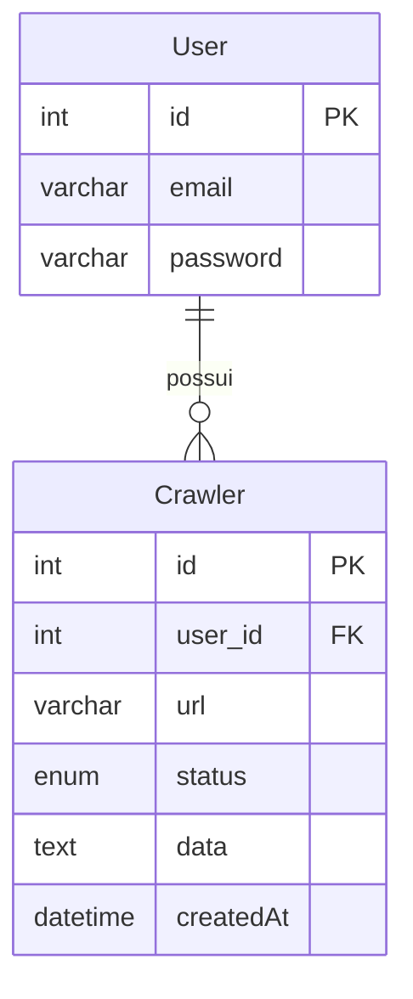

# MySQL Básico *(Módulo 3)*

## Introdução

O **MySQL** é um sistema de gerenciamento de banco de dados relacional (SGBDR) amplamente utilizado em aplicações web, desde pequenos blogs até grandes sistemas corporativos. Ele organiza dados em **tabelas** e permite manipulações eficientes através da linguagem SQL (Structured Query Language). Neste módulo, você aprenderá os conceitos essenciais para a criação de tabelas, uso de comandos SQL e otimização de consultas, com exemplos práticos utilizando as tabelas **User** e **Crawler**.

O MySQL geralmente roda na porta **3306** e pode ser facilmente gerenciado através do Docker, que facilita o processo de instalação e gerenciamento do MySQL para iniciantes. Você pode conectar à instância do MySQL no Docker através do endereço `localhost:3306`. Para acessar o MySQL via terminal, utilize o comando:

```bash
docker exec -ti mysql_server mysql -uroot -p
```

Digite sua senha e você estará conectado ao MySQL.

## Objetivos de Aprendizagem

Ao final deste módulo, você será capaz de:

- Compreender os conceitos básicos de bancos de dados relacionais.
- Criar tabelas no MySQL com chaves primárias e estrangeiras.
- Utilizar índices para otimizar a performance de consultas.
- Executar operações básicas: **SELECT**, **INSERT**, **UPDATE** e **DELETE**.
- Aplicar boas práticas na manipulação de dados e estruturação de consultas SQL.

---

## 1. Conceitos Fundamentais

Antes de começarmos com os exemplos práticos, é importante entender alguns conceitos fundamentais em bancos de dados relacionais.

### 1.1. Tabelas e Colunas

- **Tabela**: Estrutura que armazena dados em linhas e colunas.
- **Coluna**: Representa um atributo dos dados, definido por um nome e um tipo de dado.

### 1.2. Tipos de Dados Comuns

- **INT**: Números inteiros.
- **VARCHAR(n)**: Cadeia de caracteres de tamanho variável, com limite de `n` caracteres.
- **TEXT**: Texto de tamanho variável.
- **DATETIME**: Data e hora.
- **ENUM**: Conjunto de valores pré-definidos.

### 1.3. Chaves e Índices

- **Chave Primária (PRIMARY KEY)**: Campo que identifica unicamente cada registro na tabela. Não pode ser nulo ou duplicado.
- **Chave Estrangeira (FOREIGN KEY)**: Campo que referencia a chave primária de outra tabela, estabelecendo um relacionamento entre as tabelas.
- **Índice (INDEX)**: Estrutura que melhora a velocidade das operações de consulta em uma tabela.

### 1.4. Restrições de Integridade

- **NOT NULL**: Garante que o campo não pode ser nulo.
- **UNIQUE**: Garante que todos os valores em uma coluna são únicos.
- **DEFAULT**: Define um valor padrão para uma coluna quando nenhum valor é especificado.

---

## 2. Estrutura de Tabelas no MySQL

Com base nos conceitos acima, vamos criar as tabelas **User** e **Crawler**, seguindo um modelo de banco de dados relacional.

### 2.1. Diagrama Entidade-Relacionamento (ER)


```
[User]
 - id (PK)
 - email
 - password

[Crawler]
 - id (PK)
 - user_id (FK)
 - url
 - status
 - data
 - createdAt
```



- **PK**: Primary Key (Chave Primária)
- **FK**: Foreign Key (Chave Estrangeira)

### 2.2. Criando Tabelas

#### **Tabela User**

A tabela **User** armazena informações básicas dos usuários, como **email** e **senha**. Abaixo está a estrutura com as restrições aplicadas:

```sql
CREATE TABLE User (
    id INT AUTO_INCREMENT PRIMARY KEY,
    email VARCHAR(255) UNIQUE NOT NULL,
    password VARCHAR(255) NOT NULL
);
```

- **id**: Identificador único do usuário (chave primária).
- **email**: Endereço de email do usuário (único e não nulo).
- **password**: Senha do usuário (não nula).

#### **Tabela Crawler**

A tabela **Crawler** armazena informações sobre processos de rastreamento, cada um vinculado a um usuário específico.

```sql
CREATE TABLE Crawler (
    id INT AUTO_INCREMENT PRIMARY KEY,
    user_id INT NOT NULL,
    url VARCHAR(255) NOT NULL,
    status ENUM('PENDING', 'DONE', 'ERROR') DEFAULT 'PENDING',
    data TEXT,
    createdAt DATETIME DEFAULT CURRENT_TIMESTAMP,
    FOREIGN KEY (user_id) REFERENCES User(id)
);
```

- **user_id**: Referencia o usuário associado (chave estrangeira, não nula).
- **url**: URL a ser rastreada (não nula).
- **status**: Estado atual do processo de rastreamento, com valores pré-definidos.
- **data**: Dados retornados do rastreamento.
- **createdAt**: Data e hora de criação do registro.

---

## 3. Índices e Performance

Os **índices** são fundamentais para otimizar a performance das consultas, especialmente em colunas frequentemente usadas em condições de filtro ou junções.

### 3.1. Tipos de Índices

- **Primary Key Index**: Criado automaticamente na coluna definida como chave primária.
- **Unique Index**: Impede valores duplicados na coluna indexada.
- **Foreign Key Index**: Ajuda na integridade referencial e performance de consultas que envolvem chaves estrangeiras.
- **Regular Index**: Usado para acelerar consultas em colunas específicas.

#### Criando um Índice na Coluna `user_id` da Tabela `Crawler`

```sql
CREATE INDEX idx_user_id ON Crawler(user_id);
```

### 3.2. Vantagens dos Índices

- **Melhoria na Performance**: Acelera a execução de consultas e operações de busca.
- **Garantia de Unicidade**: Em índices únicos, assegura que não haja valores duplicados.
- **Otimização de Relacionamentos**: Facilita operações envolvendo junções entre tabelas relacionadas.

---

## 4. Operações Básicas: SELECT, INSERT, UPDATE e DELETE

Nesta seção, abordaremos as operações fundamentais para manipulação de dados no MySQL.

### 4.1. SELECT - Consultando Dados

#### 4.1.1. Selecionar um Usuário por Email

```sql
SELECT * FROM User WHERE email = 'usuario@exemplo.com';
```

#### 4.1.2. Selecionar Todos os Crawlers de um Usuário

```sql
SELECT * FROM Crawler WHERE user_id = 1;
```

#### 4.1.3. Selecionar Dados com JOIN

```sql
SELECT User.email, Crawler.url, Crawler.status
FROM User
INNER JOIN Crawler ON User.id = Crawler.user_id
WHERE User.id = 1;
```

### 4.2. INSERT - Inserindo Dados

#### 4.2.1. Inserir um Novo Usuário

```sql
INSERT INTO User (email, password) 
VALUES ('novo.usuario@exemplo.com', 'senhaSegura123');
```

#### 4.2.2. Inserir Novos Crawlers para um Usuário

```sql
INSERT INTO Crawler (user_id, url, status) 
VALUES 
(1, 'https://www.exemplo.com', 'PENDING'),
(1, 'https://www.exemplo2.com', 'PENDING');
```

### 4.3. UPDATE - Atualizando Dados

#### 4.3.1. Atualizar o Status de um Crawler

```sql
UPDATE Crawler
SET status = 'DONE', data = 'Resultado do rastreio'
WHERE id = 1;
```

### 4.4. DELETE - Excluindo Dados

#### 4.4.1. Excluir um Crawler

```sql
DELETE FROM Crawler WHERE id = 1;
```

---

## 5. Boas Práticas e Dicas

- **Evitar SQL Injection**: Use consultas parametrizadas ou procedimentos armazenados para evitar ataques de injeção de SQL.
- **Nomes Descritivos**: Use nomes de tabelas e colunas que reflitam claramente seu propósito.
- **Normalização**: Estruture o banco de dados para minimizar redundâncias e inconsistências.
- **Backups Regulares**: Mantenha backups atualizados para prevenir perda de dados.

---

## 6. Prevenindo SQL Injection

**SQL Injection** é um tipo de ataque onde um invasor insere código SQL malicioso em uma consulta, explorando falhas em aplicativos que interagem com bancos de dados. Isso pode resultar em acesso não autorizado, manipulação ou exclusão de dados.

### 6.1. Exemplo de Código Vulnerável em JavaScript

Considere um aplicativo JavaScript que recebe o email e a senha de um usuário e constrói uma consulta SQL:

```javascript
let email = userInputEmail;
let password = userInputPassword;

let query = "SELECT * FROM User WHERE email = '" + email + "' AND password = '" + password + "'";
// Código para executar a consulta...
```

Se um invasor inserir `' OR '1'='1` no campo de senha, a consulta resultante será:

```sql
SELECT * FROM User WHERE email = 'usuario@exemplo.com' AND password = '' OR '1'='1';
```

Isso sempre retorna verdadeiro para `'1'='1'`, permitindo acesso não autorizado.

### 6.2. Como Prevenir SQL Injection

#### 6.2.1. Utilizar Consultas Parametrizadas

Em vez de concatenar strings para formar a consulta, utilize parâmetros para inserir os valores de forma segura.

**Exemplo Seguro em JavaScript:**

```javascript
let email = userInputEmail;
let password = userInputPassword;

let query = "SELECT * FROM User WHERE email = ? AND password = ?";
// Código para preparar e executar a consulta usando os valores de email e password...
```

Ao usar placeholders (`?`), os valores são tratados como dados, não como código, evitando a injeção de SQL.

Você também pode usar bibliotecas de acesso a banco de dados que suportam consultas parametrizadas, como Prisma, Sequelize ou Knex.

#### 6.2.2. Validar Entradas do Usuário

Antes de usar os dados fornecidos pelo usuário, valide-os para garantir que estão no formato esperado.

**Exemplo de Validação Simples:**

```javascript
function isValidEmail(email) {
    let regex = /^[^\s@]+@[^\s@]+\.[^\s@]+$/;
    return regex.test(email);
}

if (isValidEmail(email)) {
    // Prosseguir com a consulta segura
}
```

---

## 7. Exercícios Práticos

### Exercício 1: Criar a Tabela `Product`

Crie uma tabela chamada **Product** com os seguintes campos:

- `id` (INT, chave primária, auto-incremento)
- `name` (VARCHAR(100), não nulo)
- `price` (DECIMAL(10,2), não nulo)
- `stock` (INT, padrão 0)

<!-- **Solução:**

```sql
CREATE TABLE Product (
    id INT AUTO_INCREMENT PRIMARY KEY,
    name VARCHAR(100) NOT NULL,
    price DECIMAL(10,2) NOT NULL,
    stock INT DEFAULT 0
);
``` -->

### Exercício 2: Inserir Produtos na Tabela `Product`

Insira os seguintes produtos na tabela **Product**:

1. Nome: 'Caneta', Preço: 1.50, Estoque: 100
2. Nome: 'Caderno', Preço: 15.00, Estoque: 50

<!-- **Solução:**

```sql
INSERT INTO Product (name, price, stock) VALUES
('Caneta', 1.50, 100),
('Caderno', 15.00, 50);
``` -->

### Exercício 3: Atualizar o Estoque de um Produto

Atualize o estoque do produto 'Caneta' para 120 unidades.

<!-- **Solução:**

```sql
UPDATE Product
SET stock = 120
WHERE name = 'Caneta';
``` -->

### Exercício 4: Selecionar Produtos com Preço Acima de 10

Liste todos os produtos cujo preço seja maior que 10.

<!-- **Solução:**

```sql
SELECT * FROM Product WHERE price > 10;
``` -->

---

Neste módulo, vimos:

- Os conceitos fundamentais de bancos de dados relacionais.
- Como criar tabelas com chaves primárias e estrangeiras.
- A importância dos índices para otimização de consultas.
- Operações básicas de manipulação de dados: **SELECT**, **INSERT**, **UPDATE** e **DELETE**.
- Boas práticas na estruturação e manutenção de bancos de dados.

Esses conhecimentos são essenciais para o desenvolvimento de aplicações que utilizam bancos de dados relacionais e serão aprofundados nos próximos módulos.

---

## Recursos Complementares

- **Documentação Oficial do MySQL**: [MySQL Documentation](https://dev.mysql.com/doc/)
- **Tutorial W3Schools**: [MySQL Tutorial](https://www.w3schools.com/mysql/)
- **Ferramentas Gráficas**: Considere usar o **MySQL Workbench**, **DBeaver** ou **HeidiSQL** por exemplo, para facilitar a visualização e manipulação do banco de dados.

---

## Navegar pelo Projeto

- [Apresentação do Projeto](../README.md)
- **Módulo 1**: [Arquitetura da Aplicação](../dia1/README.md)
- **Módulo 2**: [Introdução ao Docker](../dia2/README.md)
- **Módulo 3**: MySQL Básico *(Você está aqui)*
