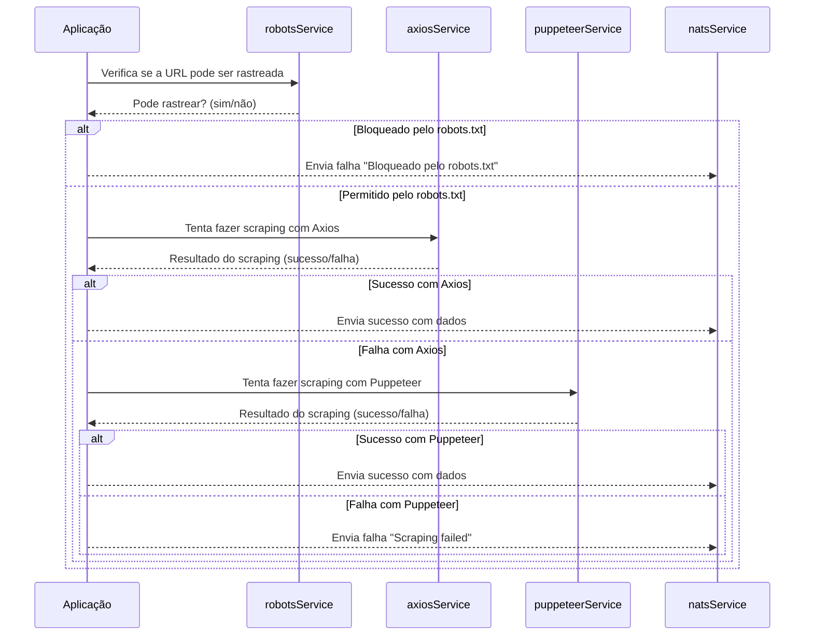

## Módulo 5: Introdução ao TypeScript com Projeto Prático

### 1. **Introdução**

Neste módulo, vamos iniciar um projeto em TypeScript do zero, configurando o ambiente, instalando as dependências necessárias e estruturando a aplicação de forma organizada. Além disso, explicaremos o propósito de cada etapa do processo para que você compreenda a importância de cada decisão tomada.


### 1.1. **O Que é TypeScript**

**TypeScript** é um superconjunto de JavaScript desenvolvido pela Microsoft que adiciona tipagem estática e outros recursos avançados à linguagem. Ele compila para JavaScript puro, permitindo que seja executado em qualquer ambiente que suporte JavaScript.

Principais características:

- **Tipagem Estática**: Define tipos para variáveis, parâmetros e retorno de funções.
- **Anotações de Tipo**: Facilita a leitura e manutenção do código.
- **Compatibilidade**: Todo código JavaScript válido é também um código TypeScript válido.
- **Suporte a Novas Funcionalidades**: Permite usar recursos mais recentes da linguagem que serão compilados para versões anteriores do JavaScript.

---

### 1.2. **Por Que Utilizar TypeScript**

- **Detecção de Erros em Tempo de Compilação**: Identifica erros antes mesmo da execução, reduzindo bugs.
- **Melhor Autocompletar e IntelliSense**: Fornece sugestões inteligentes em editores como VS Code.
- **Manutenibilidade**: Código mais fácil de entender e manter em projetos grandes.
- **Organização**: Facilita a organização de código com interfaces, enums e classes.
- **Comunidade Ativa**: Amplamente adotado em projetos modernos, com suporte de bibliotecas e frameworks.

---

### 1.3. **Onde o TypeScript é Útil**

- **Projetos de Grande Escala**: Onde a manutenibilidade e a escalabilidade são críticas.
- **Equipes Grandes**: Facilita a colaboração entre desenvolvedores.
- **Aplicações Complexas**: Com lógica de negócios sofisticada e múltiplas dependências.
- **Desenvolvimento Orientado a Interfaces**: Quando é importante definir contratos claros entre diferentes partes do código.


---

### 2. **Iniciando o Projeto NPM**

Antes de começarmos a escrever código, precisamos inicializar um projeto Node.js utilizando o NPM (Node Package Manager). Isso nos permitirá gerenciar as dependências e scripts do projeto.

#### **Passo a Passo**

1. **Criar um Diretório para o Projeto**

   ```bash
   mkdir meu-projeto-typescript
   cd meu-projeto-typescript
   ```

2. **Inicializar o NPM**

   Execute o comando:

   ```bash
   npm init -y
   ```

   **Por que fazemos isso?**

   - O comando `npm init -y` cria um arquivo `package.json` com configurações padrão, o que é essencial para qualquer projeto Node.js.
   - O arquivo `package.json` gerencia as dependências, scripts e outras configurações do projeto.
   - A opção `-y` aceita todas as configurações padrão, agilizando o processo de inicialização.

---

### 3. **Instalando o TypeScript**

O TypeScript é um superset do JavaScript que adiciona tipagem estática opcional à linguagem. Para utilizá-lo em nosso projeto, precisamos instalá-lo como uma dependência de desenvolvimento.

#### **Comando de Instalação**

```bash
npm install typescript --save-dev
```

**Por que fazemos isso?**

- **Dependência de Desenvolvimento**: Utilizamos `--save-dev` porque o TypeScript é necessário apenas durante o desenvolvimento para compilar nosso código TypeScript em JavaScript.
- **Compilador TypeScript**: A instalação inclui o compilador `tsc`, que converte o código TypeScript em JavaScript executável.

---

### 4. **Criando o Projeto TypeScript**

Agora, precisamos inicializar o TypeScript no nosso projeto, criando o arquivo de configuração `tsconfig.json`.

#### **Comando para Inicializar o TypeScript**

```bash
npx tsc --init
```

**Por que fazemos isso?**

- **`npx`**: O `npx` executa binários de pacotes NPM sem a necessidade de instalá-los globalmente.
- **Arquivo `tsconfig.json`**: Este arquivo contém as configurações do compilador TypeScript, como diretórios de entrada e saída, versão do ECMAScript e outras opções importantes para a compilação do projeto.

---

### 5. **Configurando o Arquivo `tsconfig.json`**

Precisamos ajustar algumas configurações no `tsconfig.json` para definir os diretórios de entrada e saída do nosso projeto.

#### **Alterações Necessárias**

1. Abra o arquivo `tsconfig.json` e localize as seguintes linhas comentadas:

   ```json
   // "rootDir": "./",
   // "outDir": "./",
   // "paths": { /*...*/ },
   ```

2. Descomente essas linhas e altere os valores para:

   ```json
   "rootDir": "./src",
   "outDir": "./dist",
    "paths": {
      "*": ["./src/@types/*"]
    },
   ```

**Por que fazemos isso?**

- **`rootDir`**: Define o diretório raiz dos arquivos de entrada do projeto. Estamos especificando que nosso código-fonte estará dentro da pasta `src`.
- **`outDir`**: Define o diretório onde o código compilado em JavaScript será colocado. Ao especificar `dist`, separamos o código compilado do código-fonte, mantendo o projeto organizado.
- **`paths`**: Permite definir caminhos de importação personalizados. Neste caso, estamos configurando para importar módulos de tipos personalizados a partir da pasta `src/@types`.

---

### 6. **Criando a Pasta `src` e o Arquivo `main.ts`**

Agora, vamos criar a pasta onde ficará todo o nosso código-fonte e iniciar o primeiro arquivo TypeScript.

#### **Passo a Passo**

1. **Criar a Pasta `src`**

   ```bash
   mkdir src
   ```

2. **Criar o Arquivo `main.ts`**

   Dentro da pasta `src`, crie o arquivo `main.ts`:

   ```bash
   touch src/main.ts
   ```

**Por que fazemos isso?**

- **Organização**: Manter o código-fonte em um diretório dedicado (`src`) facilita a manutenção e escalabilidade do projeto.
- **Ponto de Entrada**: O `main.ts` será o ponto de partida da aplicação, onde inicializaremos nossos serviços e lógica principal.

---

### 7. **Estrutura Atual do Projeto**

Após seguir os passos acima, a estrutura do seu projeto deve ser semelhante a:

```
meu-projeto-typescript/
├── node_modules/
├── src/
│   └── main.ts
├── package-lock.json
├── package.json
├── tsconfig.json
```

**Descrição de Cada Item:**

- **node_modules/**: Diretório onde o NPM instala as dependências do projeto.
- **src/**: Diretório contendo todo o código-fonte em TypeScript.
- **package-lock.json**: Arquivo que mantém um registro exato das versões das dependências instaladas.
- **package.json**: Arquivo de configuração do NPM, contendo scripts e dependências do projeto.
- **tsconfig.json**: Arquivo de configuração do TypeScript.

---

### 8. **Instalando Dependências do Projeto**

Para implementar as funcionalidades desejadas, precisaremos de algumas bibliotecas que nos auxiliarão em tarefas específicas.

#### **Lista de Dependências**

- **Produção**:
  - [puppeteer](https://www.npmjs.com/package/puppeteer): Biblioteca que permite controlar o Chrome ou Chromium para automação de navegação.
  - [nats](https://www.npmjs.com/package/nats): Cliente NATS para comunicação via mensageria.
  - [axios](https://www.npmjs.com/package/axios): Cliente HTTP baseado em promessas para fazer requisições.
  - [robots-txt-guard](https://www.npmjs.com/package/robots-txt-guard): Verifica se uma URL pode ser acessada de acordo com as regras do `robots.txt`.
  - [robots-txt-parse](https://www.npmjs.com/package/robots-txt-parse): Analisa arquivos `robots.txt` e extrai suas regras.

- **Desenvolvimento**:
  - [dotenv](https://www.npmjs.com/package/dotenv): Carrega variáveis de ambiente a partir de um arquivo `.env`.
  - [typescript](https://www.npmjs.com/package/typescript): Já instalado como dependência de desenvolvimento.

#### **Comando para Instalar as Dependências**

```bash
npm install puppeteer nats axios robots-txt-guard robots-txt-parse
npm install dotenv --save-dev
```

Agora, podemos criar um arquivo exemplo de testes.
Na raiz do projeto, crie um arquivo `.env` com o seguinte conteúdo:

```env
TEST=value
```

E no arquivo `main.ts`, adicione o seguinte código:

```typescript
import 'dotenv/config';

console.log(process.env.TEST)
```

Para executar o código e testar a preparação do ambiente, basta rodar o comando abaixo para realizar a transpilação e rodar o código transpilado:

```bash
npx tsc && node dist/main.js
```

Podemos também preparar nosso `package.json` com comandos úteis, como os exemplos abaixo:

```json
{
  "scripts": {
    "start:dev": "npx tsx",
    "start": "npx tsx --expose-gc --trace-gc ./src/main",
    "build": "npx tsc",
  }
}
```
basta adicionar os comandos na sessão script do `package.json` e rodar `npm run start:dev` para rodar o código em modo de desenvolvimento.

---

### 9. **Fluxo de Sequência de Funcionamento Proposto**

Para compreender melhor como nossa aplicação funcionará, vamos visualizar o fluxo de execução através de um diagrama de sequência.

#### **Diagrama de Sequência**



**Explicação do Fluxo:**

1. **Verificação do `robots.txt`**: A aplicação verifica se tem permissão para rastrear a URL desejada.
2. **Bloqueio pelo `robots.txt`**:
   - Se o acesso for negado, a aplicação envia uma mensagem de falha via NATS indicando o bloqueio.
3. **Permissão pelo `robots.txt`**:
   - Se o acesso for permitido, a aplicação tenta fazer o scraping usando o Axios.
   - **Sucesso com Axios**:
     - Envia os dados obtidos via NATS.
   - **Falha com Axios**:
     - Tenta novamente usando o Puppeteer.
     - **Sucesso com Puppeteer**:
       - Envia os dados obtidos via NATS.
     - **Falha com Puppeteer**:
       - Envia uma mensagem de falha via NATS indicando que o scraping falhou.

**Por que fazemos isso?**

- **Respeito às Regras**: Verificar o `robots.txt` é uma boa prática que evita problemas legais e éticos.
- **Eficiência**: Tentar primeiro com o Axios, que é mais leve, e somente usar o Puppeteer se necessário.
- **Mensageria**: Usar o NATS permite uma comunicação assíncrona e desacoplada com outros serviços ou componentes do sistema.

---

### 10. **Estrutura de Arquivos do Projeto**

Para manter o projeto organizado e facilitar a manutenção, vamos adotar uma estrutura modular.

#### **Sugestão de Estrutura**

```
src/
    main.ts                - Inicia a aplicação, utiliza crawlerService e messengerService
    services/
        messengerService.ts - Gerencia a conexão e comunicação com o NATS
        requestService.ts   - Decide entre axiosRequest ou puppeteerRequest e retorna o resultado
        crawlerService.ts   - Orquestra o fluxo: verifica o robots.txt e realiza o scraping
    helpers/
        axiosRequest.ts     - Retorna uma instância do Axios configurada
        puppeteerRequest.ts - Retorna uma instância do Puppeteer configurada
        robotsChecker.ts    - Gerencia a verificação do robots.txt
        logger.ts           - Gerencia os logs usados pela aplicação
```

**Descrição de Cada Arquivo:**

- **main.ts**: Ponto de entrada da aplicação; inicializa os serviços necessários.
- **services/**:
  - **messengerService.ts**: Responsável por estabelecer e gerenciar a conexão com o NATS, facilitando o envio e recebimento de mensagens.
  - **requestService.ts**: Contém a lógica para decidir qual método de scraping usar (Axios ou Puppeteer) e retorna os dados obtidos.
  - **crawlerService.ts**: Orquestra todo o processo, desde a verificação do `robots.txt` até o envio dos resultados via NATS.
- **helpers/**:
  - **axiosRequest.ts**: Configura e retorna uma instância do Axios pronta para uso.
  - **puppeteerRequest.ts**: Configura e retorna uma instância do Puppeteer, seguindo um padrão semelhante ao Axios para uniformizar a interface.
  - **robotsChecker.ts**: Contém funções para baixar e analisar o `robots.txt` de um site e verificar se uma URL específica pode ser rastreada.
  - **logger.ts**: Centraliza a lógica de logging, permitindo fácil alteração ou configuração dos níveis de log e formatos.

**Por que fazemos isso?**

- **Modularidade**: Separar a aplicação em módulos claros facilita a manutenção, testes e escalabilidade.
- **Reutilização**: Funções auxiliares nos `helpers` podem ser reutilizadas em diferentes partes do projeto.
- **Organização**: Uma estrutura bem definida torna o projeto mais legível e compreensível para outros desenvolvedores.

---

### 11. **Próximos Passos**

Com o ambiente configurado e a estrutura definida, estamos prontos para começar a implementar as funcionalidades do projeto:

- **Implementar o `robotsChecker.ts`**: Para verificar se a URL pode ser rastreada.
- **Desenvolver o `axiosRequest.ts` e `puppeteerRequest.ts`**: Para realizar o scraping das páginas.
- **Criar o `messengerService.ts`**: Para enviar os resultados ou erros via NATS.
- **Construir o `crawlerService.ts`**: Para orquestrar o fluxo entre verificação e scraping.
- **Atualizar o `main.ts`**: Para iniciar o processo e integrar todos os componentes.

---

## Navegar pelo Projeto

- [Apresentação do projeto](../README.md)
- **Módulo 1**: [Arquitetura da Aplicação](../dia1/README.md)
- **Módulo 2**: [Introdução ao Docker](../dia2/README.md)
- **Módulo 3**: [MySQL Básico](../dia3/README.md)
- **Módulo 4**: [NATS e Mensageria](../dia4/README.md)
- **Módulo 5**: Introdução ao TypeScript com Projeto Prático *(Você está aqui)*
- **Módulo 6**: [Introdução ao NestJS e Criação do Gateway](../dia6/README.md)
- **Módulo 7**: [Aplicação de API com NestJS e NATS](../dia7/README.md)
